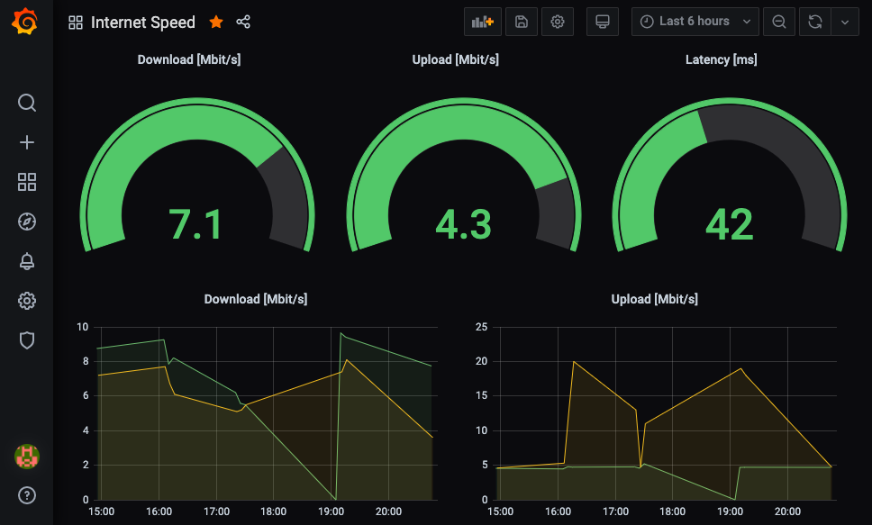

# **I**nternet **Sp**eed **Mon**itor

A simple tool to monitor your internet speed.



## Architecture

A simple script measures the speed (download,upload and latency) and saves the result in a database. A [Grafana Dashboard](https://grafana.com/grafana/) then visualizes the data.

## Installation Guide

### Using `docker-compose`

Build and install the tool:

```bash
git clone git@github ...
cd isp-mon
docker-compose up
```

Once the containers are launched, visit [http://localhost:3000](http://localhost:3000). Log in using the username `admin` and password `admin`. In the menu on the lefhand side add a new data source.
Choose MySql, with the host `db`, the port `3306`, the user `grafanaReader` with the password `readOnly` and save the data source.

Now a new dashboard can be added. By using the query builder, a lot of different vizualizations can be easily added to the dashboard. Alternatively the dashboard defined in  `dashboard.json` can be imported. 

### Using a custom MySql database

Create a new MySql database and initialize it with the `schema.sql` schema, then adjust the respective variables in the `.env` file.
Grafana can be initialized in the same way as when using `docker-compose`.

Either use the Dockerfile to build a standalone image for the speed tests or install the script without docker.

#### Without docker (needs `node` and `npm` installed)

```
npm install
npm run start
```

#### With Docker

1. Build
   
    ```
    docker build -t measure .
    ```

2. Start (starts measuring)  

    ```
    docker run -dit --name measure --env_file .env measure
    ```

3. (Optional) Connect to the container  
  
    ```
    docker exec -it measure bash
    ```

If the database runs on a Docker container on the same host, either point to the database using the local IP of the host, or better create a shared Docker network for both containers.